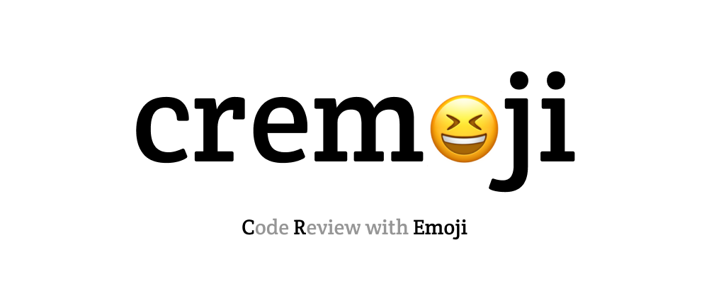
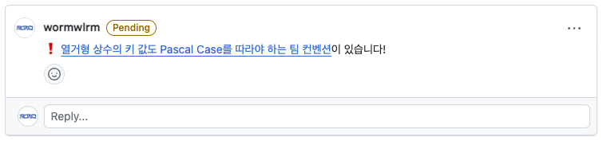
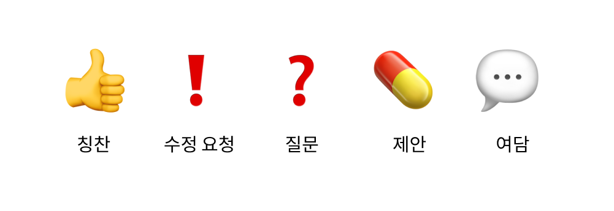

# cremoji

> `cremoji` 는 이모지 기반의 코드 리뷰 규칙입니다.

## 제안 배경

- 코드 리뷰 시 달리는 코멘트의 성격을 이모지를 이용해 명시적으로 표현함
- 리뷰어와 리뷰이의 혼란을 줄임과 동시에 리뷰의 효율성을 높이기 위해 제안

## 사용 방법

- 리뷰어는 코드 리뷰에서 코멘트를 작성할 때, 사전 정의된 이모지를 코멘트의 제일 앞에 작성함
- 이모지와 코멘트는 띄어쓰기로 구분함

## 이모지

- 코드 리뷰에서 자주 맞닥뜨리는 상황을 고려하여 다음과 같은 다섯 개의 이모지를 제안

| 이모지                  | 설명                                                                                      | 리뷰 제출 시                                                                                             | 판단 우선 순위 |
| ----------------------- | ----------------------------------------------------------------------------------------- | -------------------------------------------------------------------------------------------------------- | -------------- |
| 👍 (`:+1:`)             | 리뷰어가 리뷰이의 코드에서 칭찬의 의견을 남기고 싶을 때 사용                              | `Approve` 로 간주                                                                                        | 낮음           |
| ❗ (`:exclamation:`)    | 리뷰어가 리뷰이에게 필수적으로 코드 수정을 요청할 때 사용                                 | 1개라도 포함되어 있다면 `Request changes` 로 제출                                                        | 높음           |
| ❓ (`:question:`)       | 리뷰어가 리뷰이의 코드에서 이해하기 어려운 부분을 질문할 때 사용                          | 질문 코멘트의 답변이 리뷰 결과에 영향을 주는 경우에만 `Comment` 로 제출   이 외는 `Approve` 로 간주 | 보통           |
| 💊 (`:pill:`)           | 리뷰어가 리뷰이의 코드에서 개선된 방법을 제안하지만 그것의 반영이 필수까지는 아닐 때 사용 | `Approve` 로 간주                                                                                        | 낮음           |
| 💬 (`:speech_balloon:`) | 리뷰어가 단순히 개인의 감상이나 의견, 여담을 남거나 공유하고 싶을 때 사용                 | `Approve` 로 간주                                                                                        | 낮음           |

## 권장 사항

- 구성원 간 합의를 통해 새로운 이모지를 추가하거나 수정할 수 있음
- [깃허브에서 제공하는 자주 쓰는 답변 기능](https://docs.github.com/ko/get-started/writing-on-github/working-with-saved-replies/creating-a-saved-reply)을 활용해 이모지를 빠르게 입력할 수 있도록 설정하기
- 너무 많은 이모지는 오히려 혼란을 유발하므로 이모지 개수는 2~6개 사이를 유지하기

## 참고

> - [우리, 이모지로 코드 리뷰 할까요?](https://wormwlrm.github.io/2024/02/04/Code-Review-with-Emoji.html)
> - [How We Do Code Review](https://devblogs.microsoft.com/appcenter/how-the-visual-studio-mobile-center-team-does-code-review/)
> - [Code Review Emoji Guide](https://github.com/axolo-co/developer-resources/tree/main/code-review-emoji-guide)
> - [Emoji Code Review Comments](https://gist.github.com/chrisriesgo/818fe94b4f4720eaf7898ccaa48f94c5)
